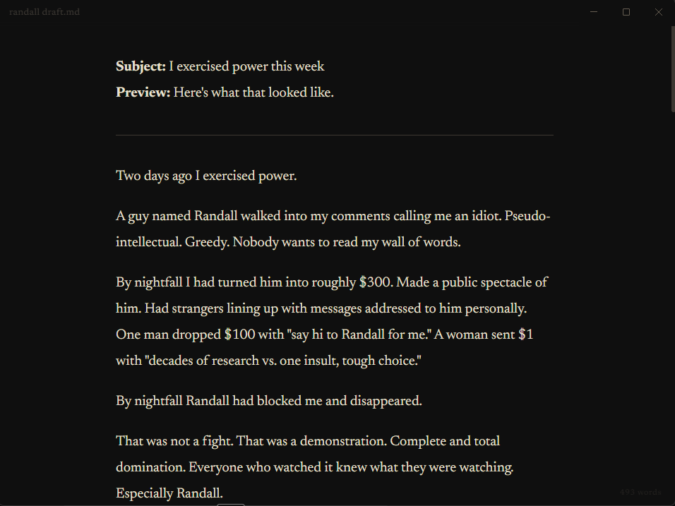

# Markdown Writer

A distraction-free Markdown editor for people who actually write.

No cloud. No accounts. No toolbar clutter. Just your words on a dark canvas with a cursor that blinks when you stop typing.


---

## Why this exists

Every Markdown editor wants to be an IDE, a note-taking system, or a second brain. This one just wants to get out of your way.

I built it because I write every day, and I got tired of apps that treat formatting toolbars and file trees as features instead of noise. Markdown Writer opens fast, saves automatically, and never asks you to sign in.

## Features

**Focus Mode** (F8) -- dims everything except the paragraph you're writing. The rest of your document fades to near-invisible. When you're in flow, nothing else exists.

**Collapsible Headings** -- click the chevron next to any heading to collapse everything beneath it. Useful for long documents where you only care about one section right now.

**Tabs** -- open multiple files without spawning windows. The tab bar stays hidden until you need it (2+ files open).

**Find & Replace** (Ctrl+F / Ctrl+H) -- inline search with match counting, case-insensitive by default. Replace one or replace all.

**Bubble Menu** -- select text and a floating toolbar appears. Bold, italic, strikethrough, headings, quotes, lists. Nothing you didn't ask for.

**Five Serif Fonts** -- cycle with Ctrl+/. Cormorant Garamond, Lora, Newsreader, Literata, Spectral. Your choice persists between sessions.

**Auto-Save** -- saves 1.5 seconds after you stop typing. If the app crashes or you close it, your draft is recovered on next launch, cursor position and all.

**Drag & Drop** -- drop a `.md` or `.txt` file onto the window to open it.

**Word Count** -- bottom of the screen, always visible, never in the way.

## Screenshot



## Install

### From release (recommended)

Download the latest build from [Releases](../../releases), unzip, and run `Markdown Writer.exe`.

### From source

```bash
git clone https://github.com/DrunkPlato21/markdown-writer.git
cd markdown-writer
npm install
npm run dev
```

Requires Node.js 18+ and npm.

| Command | What it does |
|---------|-------------|
| `npm run dev` | Starts Vite dev server + Electron with hot reload |
| `npm start` | Builds and launches the production app |
| `npm run package` | Creates a Windows distributable in `release/` |

## Stack

| Layer | Tech |
|-------|------|
| Editor | [Tiptap 2](https://tiptap.dev) + [tiptap-markdown](https://github.com/aguingand/tiptap-markdown) |
| Desktop | [Electron 34](https://www.electronjs.org/) |
| Build | [Vite 6](https://vitejs.dev/) |
| Packaging | [electron-builder](https://www.electron.build/) |
| Fonts | Google Fonts (5 serif families) |

## Keyboard Shortcuts

| Shortcut | Action |
|----------|--------|
| Ctrl+N | New file |
| Ctrl+O | Open file |
| Ctrl+S | Save |
| Ctrl+W | Close tab |
| Ctrl+F | Find |
| Ctrl+H | Find & Replace |
| Ctrl+/ | Cycle font |
| F8 | Toggle focus mode |
| F11 | Toggle fullscreen |
| Ctrl+B | Bold |
| Ctrl+I | Italic |

## Project Structure

```
markdown-writer/
  src/
    editor.js        # Editor core, tabs, autosave, file operations
    search.js        # Find/replace Tiptap extension
    focus.js         # Focus mode extension
    collapse.js      # Collapsible headings extension
    styles.css       # Dark theme, all UI styling
  electron/
    main.js          # Electron main process, IPC, window management
    preload.js       # Context bridge for secure renderer communication
  index.html         # Entry point
  package.json
  vite.config.js
```

## Design

Dark background (`#0f0f0f`), warm off-white text (`#e8e0d0`), gold accents (`#c9a84c`). Optimized for long writing sessions without eye strain. No light mode -- by design.

## License

MIT
